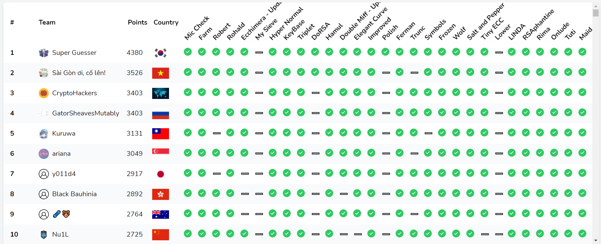

# Crypto CTF 2021

# Index

| Names                  |Genre               |Point      |Solves|
|------------------------|---------------------|----------|------|
| [`Mic Check`](Mic%20Check/)|warm-up|19|440|
| [`Farm`](farm/)|easy|41|149|
| [`KeyBase`](keybase/)|easy|48|118|
| [`Symbols`](Symbols/)|easy|70|70|
| [`Hyper Normal`](hyper_normal/)|medium-easy|71|69|
| [`Hamul`](hamul/)|medium-easy|83|56|
| [`Rima`](Rima/)|medium-easy|56|93|
| [`Robert`](Robert/)|medium|194|19|
| [`Triplet`](Triplet/)|medium|91|50|
| [`Elegent Curve`](elegant_curve/)|medium|217|16|
| [`Improved`](improved/)|medium|117|37|
| [`Ferman`](Ferman/)|medium|134|31|
| [`Salt and Pepper`](salt_pepper/)|medium|71|69|
| [`Tiny ECC`](tiny_ecc/)|medium|217|16|
| [`Onlude`](Onlude/)|medium|95|48|
| [`Tuti`](Tuti/)|medium|69|71|
| [`Maid`](maid/)|medium|119|36|
| [`Ecchimera`](ecchimera/)|medium-hard|271|11|
| [`Double Miff`](double_miff/)|medium-hard|217|16|
| [`Frozen`](frozen/)|medium-hard|142|29|
| [`Wolf`](Wolf/)|medium-hard|128|33|
| [`LINDA`](linda/)|medium-hard|169|23|
| [`RSAphantine`](RSAphantine/)|medium-hard|142|29|
| [`Rohald`](Rohald/)|hard|180|21|
| [`My Sieve`](My%20Sieve/)|hard|477|1|
| [`DoRSA`](DoRSA/)|hard|450|2|
| [`TRUNC`](TRUNC/)|hard|334|7|
| [`Lower`](lower/)|hard|500|0|
| [`Polish`](polish_attack/)|tough|477|1|
