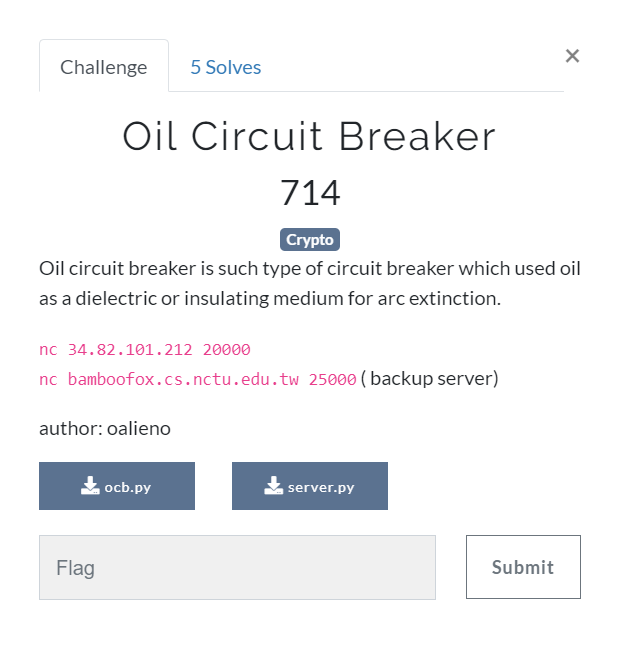

# Oil Circuit Breaker (Crypto) \[714\]

## __Description__



## __Solution__

It's an OCB2 cipher, and its vulnerability can be found [here](https://eprint.iacr.org/2018/1040.pdf).

First encryption, send in:

```
nonce = 00000000000000000000000000000000
plain = 000000000000000000000000000000010000000000000000000000000000008000000000000000000000000000000000
                                       1                             128                               0
```
Get C\[0\]+C+\[1\]+C\[2\] and T.

In descryption, send in:
```
nonce  = 00000000000000000000000000000000
cipher = C[0] ^ (1 ^ 128).to_bytes(64, 'big')
tag    = C[2] ^ nonce 

```
