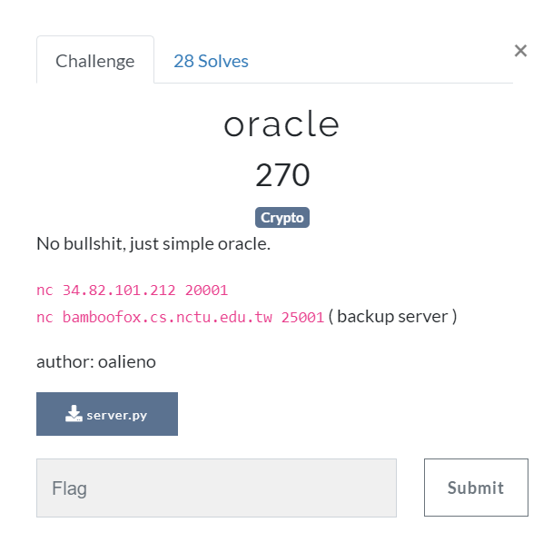

# oracle

## Description



## Soluion

The server is an RSA decryptor but only send the messages after being modded by 3.

Send the original ciphertext c and you will receive m%3.

```
c -> m  
m = an * pow(3,n) + an-1 * pow(3,n-1) + ... + a1 * 3 + a0

=> r = m % 3 = a0
```
Where r is received numbers.

Now calculate pow(3,-1), the inverse of 3 to n, and send pow(3,-1) * c (mod n), you should get pow(3,-1) * m (mod n)
```
pow(3,-1)c -> pow(3,-1)m
pow(3,-1)m =  an * pow(3,n-1) + an-1 * pow(3,n-2) + ... + a1 + a0 * pow(3,-1)

=> r = a1 + (a0 * pow(3,-1) (mod n)) (mod 3)
=> a1 = r - (a0 * pow(3,-1) (mod n)) (mod 3)
```
Send pow(3,-2) * m(mod n):
```
pow(3,-2)c -> pow(3,-2)m
pow(3,-2)m =  an * pow(3,n-2) + an-1 * pow(3,n-3) + ... + a2 + a1 * pow(3, -1) + a0 * pow(3,-2)

=> r = a2 + (a1 * pow(3,-1) (mod n)) + (a0 * pow(3,-2) (mod n)) (mod 3)
=> a2 = r - (a1 * pow(3,-1) (mod n)) - (a0 * pow(3,-2) (mod n)) (mod 3)
```
Repeat until getting 0 multiple times, and you can calculate the message by (a0, a1, ..., an).

```
BAMBOOFOX{SimPlE0RACl3}
```
