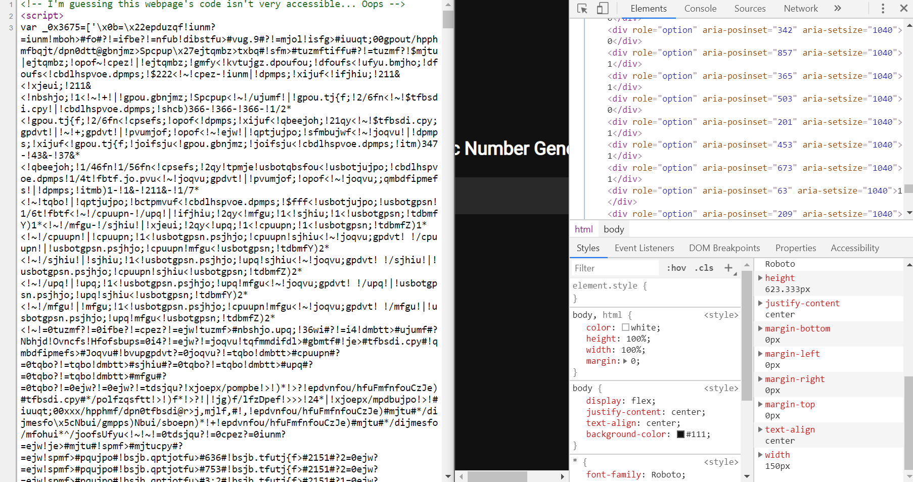

##### Golems_treat didn't solve the challenge during the CTF
## Problem info
<table>
  <tr>
    <td><strong>Name</strong></td>
    <td>Accessible Rich Internet Applications</td>
  </tr>
  <tr>
    <td><strong>Category</strong></td>
    <td>Web</td>
  </tr>
  <tr>
    <td><strong>Message</strong></td>
    <td>Written by: NotDeGhost<br>
A very considerate fellow, Rob believes that accessibility is very important!<br>
<b>NOTE: The flag for this challenge starts with <font color = "F11766">flag{</font> instead of <font color = "F11766">hsctf{</font></b>
</td>
  </tr>
  <tr>
    <td><strong>Flags</strong></td>
    <td>flag{accessibility_is_crucial}</td>
  </tr>
  <tr>
    <td><strong>Files</strong></td>
    <td>index.html</td>
  </tr>
  <tr>
    <td><strong>Tags</strong></td>
    <td>Web</td>
  </tr>
  <tr>
    <td><strong>Hints</strong></td>
    <td></td>
  </tr>
</table>

## Solutions during CTF

We generally don't have any idea to the problem.
The original code in seeming to be no sense.
result of playing with the input bar also didn't dirve any result. 

## After CTF

Thank's to [the writeup by Dc1ph3R](https://mrt4ntr4.github.io/HSCTF-ARIA-Writeup/) suggest that things looks different in the dev console.
you could see the difference:


Notice that list is filled with interesting 0s and 1s. Copy the element down in 
[./aria.html](./aria.html) and we see there are 1040 'bits'

`1040 = 0 (mod 8)`

so the remaining work would be sorting the list and put the bits together. Could either deal with string phrasing or taking use of `Beautiful Soup`.

By running [the script](./phrasing.py), we could get the result:
```
im gonna add some filler text here so the page is a bit longer. lorem ipsum... here's the flag btw, flag{accessibility_is_crucial}
``` 

