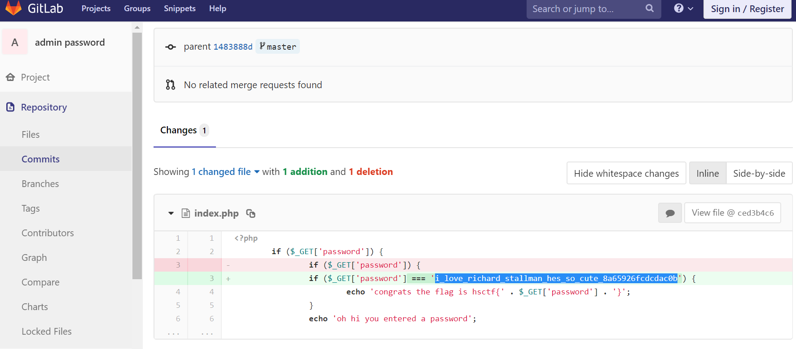

## Problem info
<table>
  <tr>
    <td><strong>Name</strong></td>
    <td>Admin pass</td>
  </tr>
  <tr>
    <td><strong>Category</strong></td>
    <td>MISC</td>
  </tr>
  <tr>
    <td><strong>Message</strong></td>
    <td>Written by: Weastie 
Hey guys, found a super cool website at http://misc.hsctf.com:8001!
</td>
  </tr>
  <tr>
    <td><strong>Flags</strong></td>
    <td>hsctf{i_love_richard_stallman_hes_so_cute_8a65926fcdcdac0b}</td>
  </tr>
  <tr>
    <td><strong>Files</strong></td>
    <td></td>
  </tr>
  <tr>
    <td><strong>Tags</strong></td>
    <td></td>
  </tr>
  <tr>
    <td><strong>Hints</strong></td>
    <td></td>
  </tr>
</table>

## Solution
At the first glance, get to the source code [github page](https://gitlab.com/WeastieWeastie/admin-password/)
Seems nothing to do with the direct injection. `===` and `md5` closed down password passing.

However, when we look into the page history, the password is in a commit history.

`hsctf{i_love_richard_stallman_hes_so_cute_8a65926fcdcdac0b}`

Beware to what you commit. 
