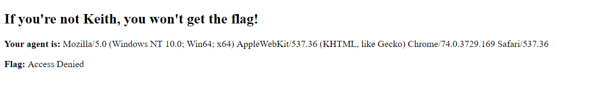
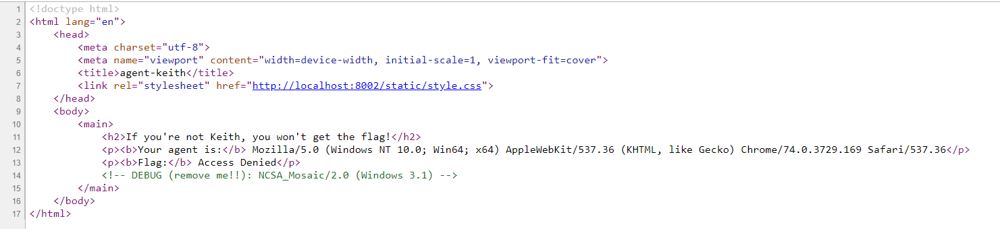
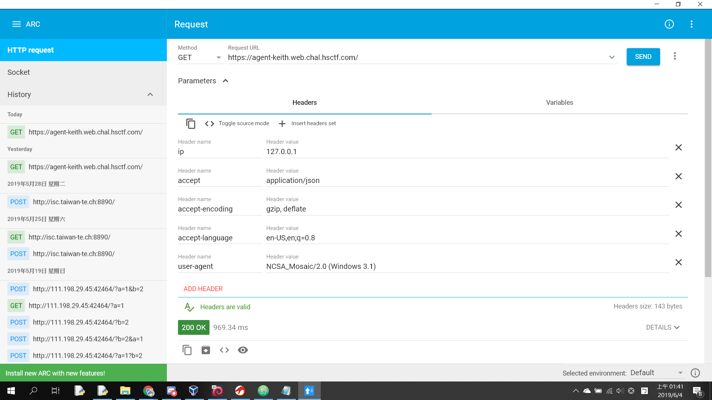
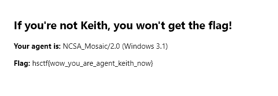

# Agent Keith

## Description

Keith was looking at some old browsers and made a site to hold his flag.

https://agent-keith.web.chal.hsctf.com

## Solution

The web asked us to be right agent.

The source page pointed out the agent we should be is __NCSA_Mosaic/2.0 (Windows 3.1)__

Make a request using Arc with the required agent.

Get access to the flag.


```
hsctf{wow_you_are_agent_keith_now}
```
