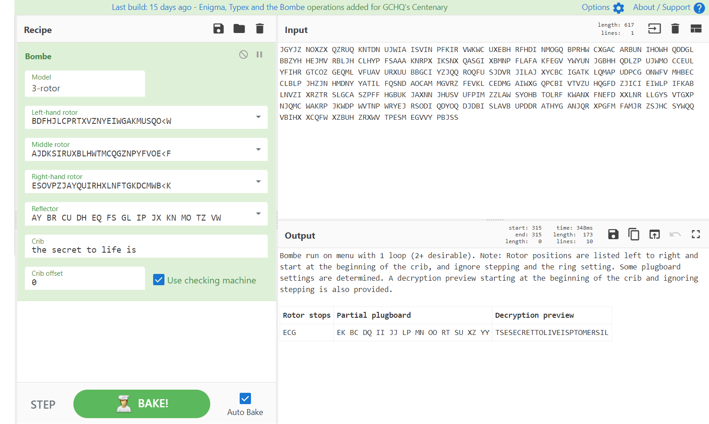
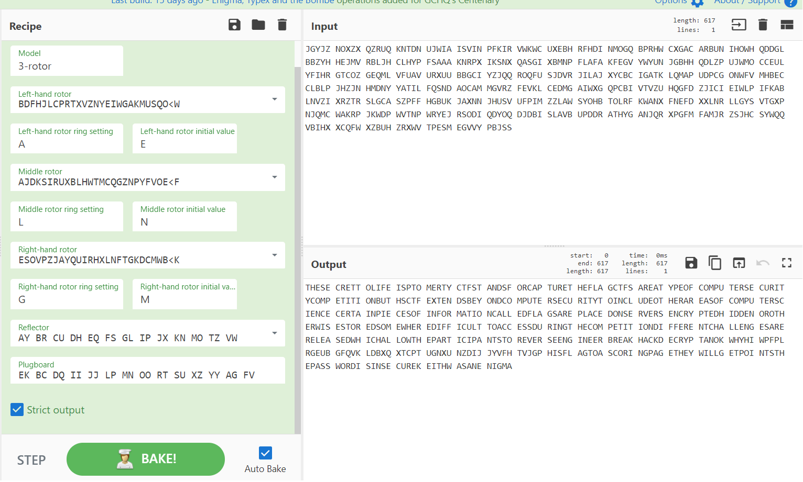
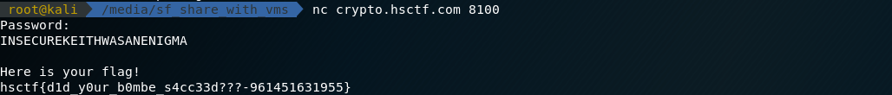

# Bomb

## Description

Keith found a weird message on his desk along with a drawing:
```
JGYJZ NOXZX QZRUQ KNTDN UJWIA ISVIN PFKIR VWKWC UXEBH RFHDI NMOGQ BPRHW CXGAC ARBUN IHOWH QDDGL BBZYH HEJMV RBLJH CLHYP FSAAA KNRPX IKSNX QASGI XBMNP FLAFA KFEGV YWYUN JGBHH QDLZP UJWMO CCEUL YFIHR GTCOZ GEQML VFUAV URXUU BBGCI YZJQQ ROQFU SJDVR JILAJ XYCBC IGATK LQMAP UDPCG ONWFV MHBEC CLBLP JHZJN HMDNY YATIL FQSND AOCAM MGVRZ FEVKL CEDMG AIWXG QPCBI VTVZU HQGFD ZJICI EIWLP IFKAB LNVZI XRZTR SLGCA SZPFF HGBUK JAXNN JHUSV UFPIM ZZLAW SYOHB TOLRF KWANX FNEFD XXLNR LLGYS VTGXP NJQMC WAKRP JKWDP WVTNP WRYEJ RSODI QDYOQ DJDBI SLAVB UPDDR ATHYG ANJQR XPGFM FAMJR ZSJHC SYWQQ VBIHX XCQFW XZBUH ZRXWV TPESM EGVVY PBJSS

Reflector: B
Rotors: 3,2,4
Crib: the secret to life is
```
Keith is very confused. Help Keith find out what the message means.

nc crypto.hsctf.com 8100

[bomb.png](bomb.png)

## Solution

I ran into this [website](https://github.com/gchq/CyberChef/wiki/Enigma,-the-Bombe,-and-Typex) that told me how to decrypt the enigma cipher using bombe.

__First__, using the crib, we can find an approximate initial state and plugboard config.



```
Rotor stops : ECG

Partial plugboard: EK BC DQ II JJ LP MN OO RT SU XZ YY

Decrypted preview: TSESECRETTOLIVEISPTOMERSIL
```

__Next__, put the setting in the bombe page, the ecrypted message look like this:


We also need to turn the rightmost rotor to the right offset, until the message looks like the preview one.

Turning to ```(G, M)``` looks promising.

Now the plugboard is missing some characters. They are ```A, F, G, H, V```.

Trying different combination, the ```AG, FV ``` give me the most meaningful result.


__Last__, adjust the middle rotor until the most important part of the last part of the decypted message gives me the password.



The message reads

```
THESE CRETT OLIFE ISPTO MERTY CTFST ANDSF ORCAP TURET HEFLA GCTFS AREAT YPEOF COMPU TERSE CURIT YCOMP ETITI ONBUT HSCTF EXTEN DSBEY ONDCO MPUTE RSECU RITYT OINCL UDEOT HERAR EASOF COMPU TERSC IENCE CERTA INPIE CESOF INFOR MATIO NCALL EDFLA GSARE PLACE DONSE RVERS ENCRY PTEDH IDDEN OROTH ERWIS ESTOR EDSOM EWHER EDIFF ICULT TOACC ESSDU RINGT HECOM PETIT IONDI FFERE NTCHA LLENG ESARE RELEA SEDWH ICHAL LOWTH EPART ICIPA NTSTO REVER SEENG INEER BREAK HACKD ECRYP TANOK WHYHI WPFPL RGEUB GFQVK LDBXQ XTCPT UGNXU NZDIJ JYVFH TVJGP HISFL AGTOA SCORI NGPAG ETHEY WILLG ETPOI NTSTH EPASS WORDI SINSE CUREK EITHW ASANE NIGMA
```



The flag is
```
hsctf{d1d_y0ur_b0mbe_s4cc33d???-961451631955}
```
