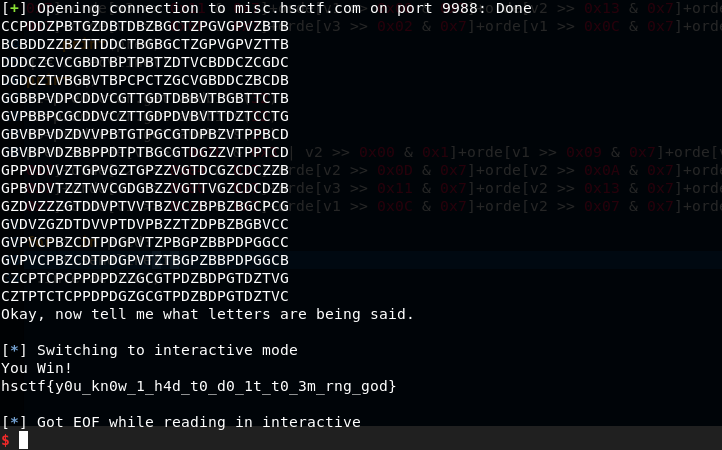

# English Sucks

__Description__

English is such a confusing language. Can you help me understand it?

```diff
- nc misc.hsctf.com 9988
```

[mt.cpp](mt.cpp)

__solution__

The given code generate 216 strings each with 3 random integers by [mt19937](https://en.wikipedia.org/wiki/Mersenne_Twister) which is an pseudorandom number generator.

```
std::mt19937 random{std::random_device()()};

auto v1 = random();
auto v2 = random();
auto v3 = random();
```

According to [this](https://github.com/kmyk/mersenne-twister-predictor), you can predict MT19937 from preceding 624 generated numbers.

But take a look the code it generate strings

```
std::cout << "BCDGPTVZ"[v2 >> 0x1F & 0x1 | v3 >> 0x0 & 0x3]
          << "BCDGPTVZ"[v1 >> 0x09 & 0x7]
          << "BCDGPTVZ"[v3 >> 0x05 & 0x7]
          << "BCDGPTVZ"[v3 >> 0x08 & 0x7]
...
```

It take every 3 bits of the numbers and decide a character.

However, the first and the last bits are not confirm because the OR operation. That causes the uncertainty of the answer.

Write a [script](solve.py) with the predictor and try it several times until it success.



```
hsctf{y0u_kn0w_1_h4d_t0_d0_1t_t0_3m_rng_god}
```
