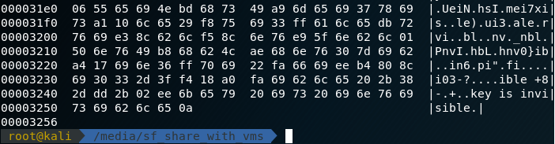
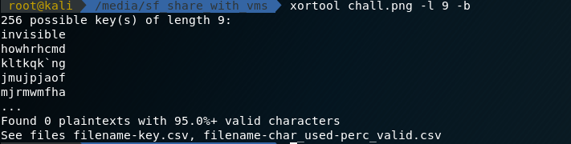

# Hidden Flag

## Description

This image seems wrong.....did Keith lose the key __again__?

[chall.png](chall.png)

## Solution

An error occured when opening the file.

The hexdump of the file give me an interesting line in the last line.



However, I don't have any idea where to use the key.

After trying a lot of different way to analyse the file, the [xortool](https://github.com/hellman/xortool) catch my eye.



It xor the whole file with different possible key.

The first key it use is literally invisible, and the first [file](xor.png) of the output give us the flag


```
hsctf{n0t_1nv1s1bl3_an5m0r3?_39547632}
```
