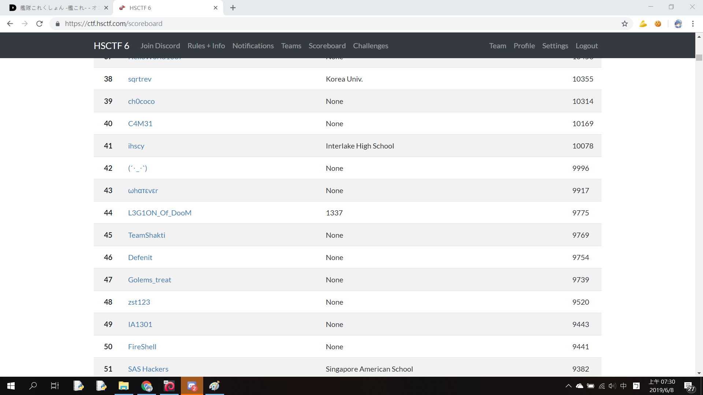
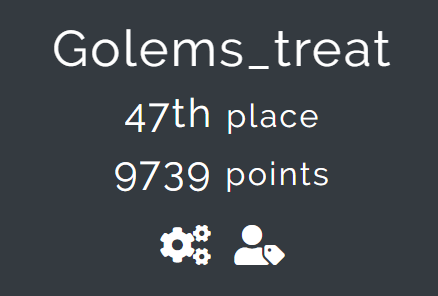
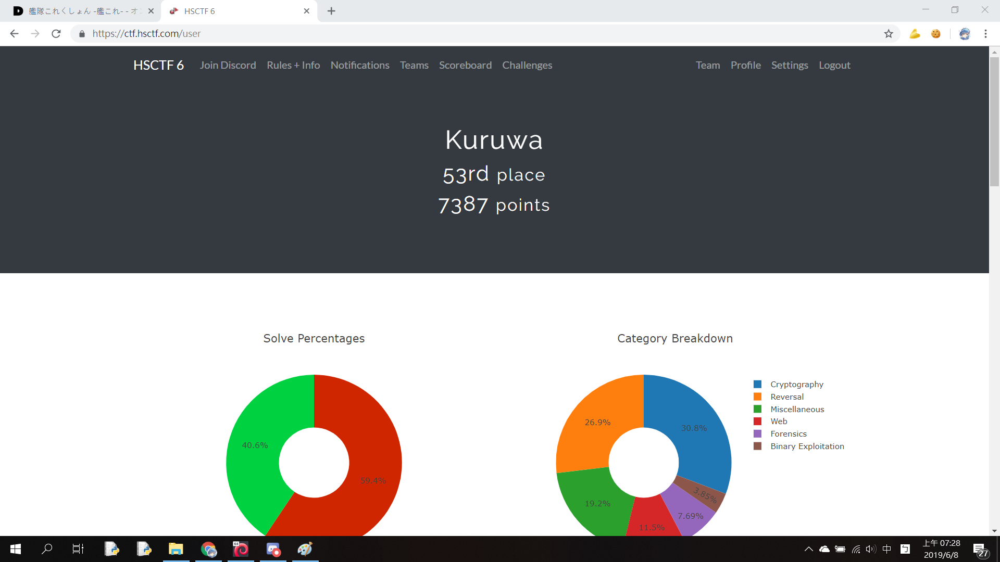

# HSCTF 6

HSCTF was a 5-day long CTF with problems released every day.

It was interesting and quite challenging.

We could perform better if we had a good pwner \_(:3」∠)\_

# Index

| Names                  |Genre               |Point      |
|------------------------|---------------------|----------|
| [`Discord`](Discord/)|Misc|10|
| [`Survey`](Survey/)|Misc|10|
| [`Verbose`](Verbose/)|Misc|118|
| [`Locked up`](Locked-up/)|Misc|132|
| [`Admin Pass`](Admin-pass/)|Misc|144|
| [`A Simple Conversation`](A-simple-conversation/)|Misc|159|
| [`The Real Reversal`](The-real-reversal/)|Misc|276|
| [`Broken GPS`](Broken%20GPS/)|Misc|282|
| [`Hidden Flag`](Hidden%20Flag/)|Misc|290|
| [`Keith Bot`](Keith%20bot/) |Misc|410|
| [`64+word`](64+word/) |Misc|423|
| [`Englist Sucks`](English%20Sucks/)|Misc|487|
| [`Reverse Search Algorithm`](Reverse%20Search%20Algorithm/)|Crypto|131|
| [`Super Secure System`](Super%20Secure%20System/)|Crypto|191|
| [`A Lost Cause`](A%20Lost%20Cause/)|Crypto|198|
| [`Massive RSA`](Massive%20RSA/)|Crypto|257|
| [`Really Secure Algoruthm`](Really%20Secure%20Algorithm/)|Crypto|316|
| [`Welcome to Crypto Land`](Welcome%20to%20Crypto%20Land/)|Crypto|340|
| [`Tux's Kitchen`](Tux's%20Kitchen/)|Crypto|405|
| [`Bomb`](Bomb/)|Crypto|452|
| [`Spooky ECC`](Spooky%20ECC/)|Crypto|457|
| [`Marginally More Spooky ECC`](Marginally%20More%20Spooky%20ECC/)|Crypto|473|
| [`Multiplication Service`](Multiplication%20Service/)|Crypto|490|
| [`Intro to Netcat`](Intro%20to%20Netcat/)|Pwn|51|
| [`Return to Sender`](Return-to-sender/)|Pwn|166|
| [`Combo Chain Lite`](Combo-chain-lite/)|Pwn|245|
| [`Storytime`](Storytime/)|Pwn|333|
| [`A Byte`](A%20Byte/)|Reverse|180|
| [`License`](License/)|Reverse|252|
| [`DaHeck`](DaHeck/)|Reverse|295|
| [`VirtualJava`](VirtualJava/)|Reverse|357|
| [`I Thought Trig Was Really Easy`](I%20Thought%20Trig%20Was%20Really%20Easy/)|Reverse|377|
| [`Tux Talk Show 2019`](Tux%20Talk%20Show%202019/)|Reverse|411|
| [`Forgot Your Password?`](Forgot%20Your%20Password/)|Reverse|467|
| [`Chicken Crossing`](Chicken-crossing)|Forensics|53|
| [`Cool Image`](Cool%20Image/)|Forensics|101|
| [`Cool Image 2`](Cool-image-2/)|Forensics|105|
| [`Slap`](Slap/)|Forensics|108|
| [`Logo Sucks Bad`](Logo-sucks-bad/)|Forensics|167|
| [`Fish`](Fish/)|Forensics|237|
| [`Double Trouble`](Double%20Trouble/)|Forensics|399|
| [`Skywriting v2`](Skywriting%20v2/)|Forensics|461|
| [`Inspect Me`](Inspect%20Me/)|Web|51|
| [`Agent Keith`](Agent%20Keith/)|Web|101|
| [`S-Q-L`](S-Q-L/)|Web|101|
| [`The Quest`](The-quest/)|Web|102|
| [`Keith Logger`](Keith-logger/)|Web|216|
| [`Md5--`](Md5--/)|Web|233|
| [`Accessible Rich Internet Applications`](Accessible-rich-internet-applications/)|Web|241|
| [`Networked Password`](Networked-password/)|Web|317|