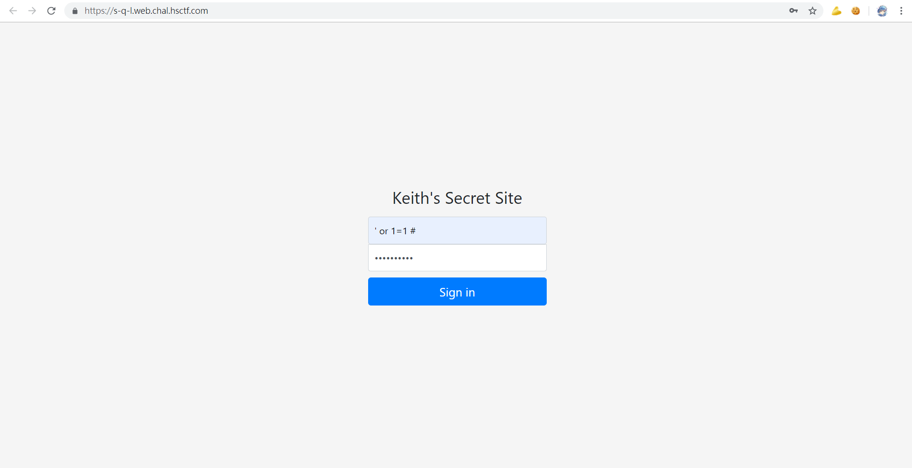
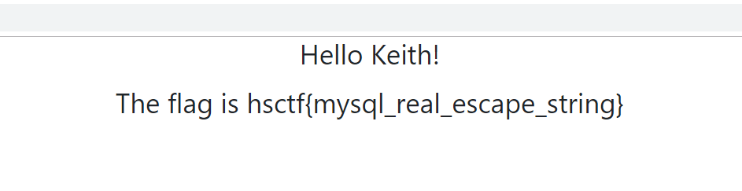

# S-Q-L

## Description

Keith keeps trying to keep his flag safe. This time, he used a database and some PHP.

https://s-q-l.web.chal.hsctf.com/

## Solution

Simple SQL injection




```
hsctf{mysql_real_escape_string}
```
