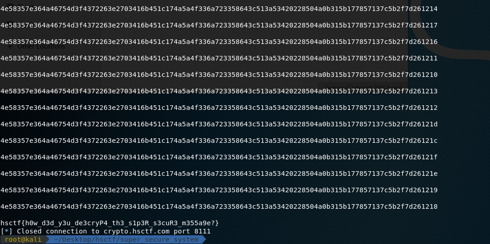

# Super Secure System

## Description

Keith made a SUPER SECURE SYSTEM!!! He claims it is so secure as long as he doesn't reuse his key...

nc crypto.hsctf.com 8111

##Solution

Sending 'hsctf{' to the server, I realized that it has same output as first line.

So I just wrote [script](solve.py) to sent all printable characters until it matched the answer.


```
hsctf{h0w_d3d_y3u_de3cryP4_th3_s1p3R_s3cuR3_m355a9e?}
```
