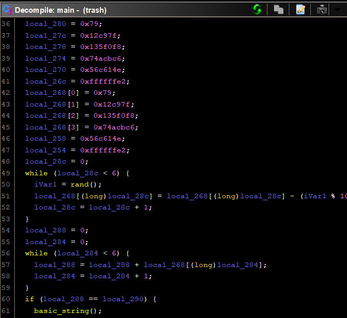
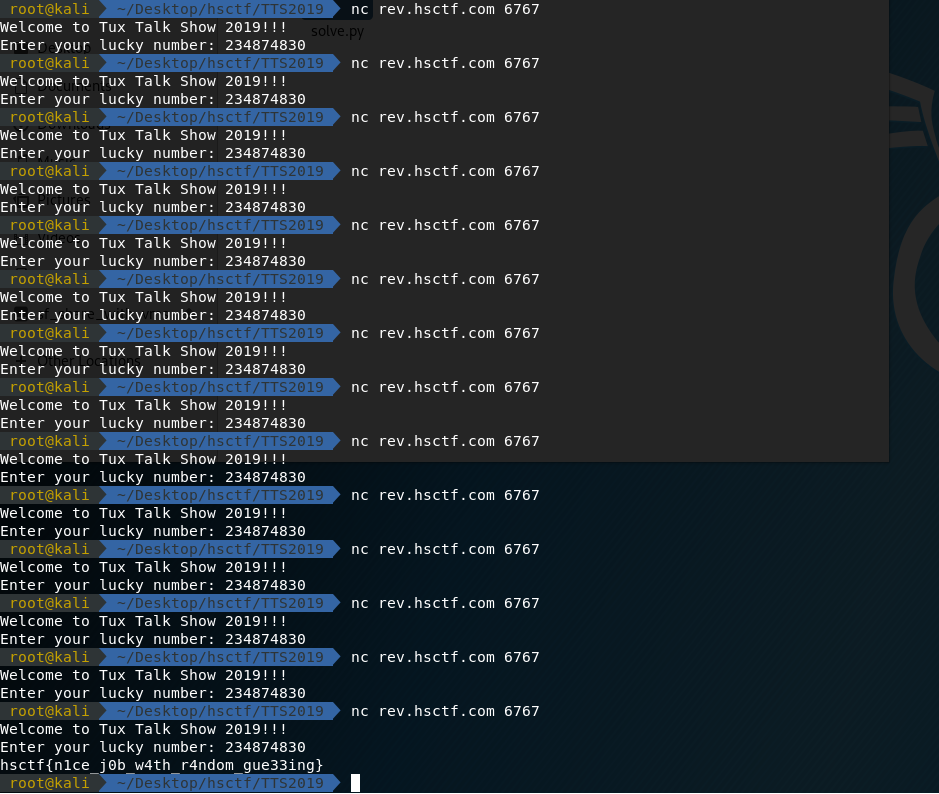

# Tux Talk Show 2019

## Description

Tux Talk Show 2019. Yes, this is trash.

nc rev.hsctf.com 6767

[trash](trash)

## Solution

It is a number guessing game, and the correct number was generated by random function.

At first, I tried using the same random [generator](random.cpp) as the code and calculated the number using [script](random.py) but to no avail.

I figured that it was because the timezone problem, the srand(time(0)) was different in different timezone.

But I noticed that the server only took the remainder of the number generated divided by 10, and there were only 6 numbers that involved in calcluating the answer.



Therefore, I might be able to guess it by guessing a possible answer several time.

And that's how I got it right!



The flag is

```
hsctf{n1ce_j0b_w4th_r4ndom_gue33ing}
```
