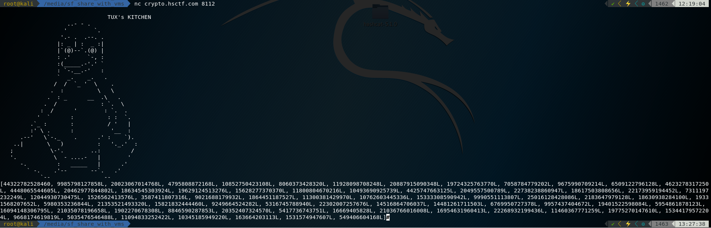

# Tux's Kitchen

## Description

I need to bake it!

nc crypto.hsctf.com 8112

[problem.py](problem.py)

### Solution

The server print a cute penguin and a list of numbers.



We can see the numbers are generate by function final_bake()

```
print(final_baking(flag,key))
```

The function's body is:

```

def final_baking(food,key):
	baked = rand0m_mess(food,key)
	treasure = []
	for i in range(len(baked)):
		treasure.append(ord(food[i])*baked[i])
		print(ord(food[i])*baked[i]))
	treasure = prepare(treasure)
	return treasure
```

I noticed that the numbers in treasure are multiple of the order of each character in the flag.

Knowing the number, I can make a list of printable candidate that is factor of the number.

And prepare() is:

```
def prepare(food):
	good_food = []
	for i in range(len(food)):
		good_food.append(food[i]^MY_LUCKY_NUMBER)
		print(food[i]^MY_LUCKY_NUMBER)
	for k in range(len(good_food)):
		good_food[i] += MY_LUCKY_NUMBER
	return good_food

```

So I first get 3 lists of numbers and reverse the prepare process.

If the character is in all three of the candidate, it's big chance that it is the answer.

Running the [script](solve.py), I get the result:

```
4hs!c:t"3f){:t4h1s_1s_07ne_;v3&9ry_$6l07ng_"3f$6l 0@`g_1b3!ca8s3_:t5(<x_$6l0;v3=z_;v;ve)R9_&LO7n9_"3f$6laGs7!}
['4h', 's', '!c', ':t', '"3f', '){', ':t', '4h', '1', 's', '_', '1', 's', '_', '0', '7n', 'e', '_', ';v', '3', '&9r', 'y', '_', '$6l', '0', '7n', 'g', '_', '"3f', '$6l', ' 0@`', 'g', '_', '1b', '3', '!c', 'a', '8', 's', '3', '_', ':t', '5', '(<x', '_', '$6l', '0', ';v', '3', '=z', '_', ';v', ';v', 'e', ')R', '9', '_', '&L', 'O', '7n', '9', '_', '"3f', '$6l', 'a', 'G', 's', '7', '!', '}']
```

Pick the word that makes sense give me the flag

```
hsctf{th1s_1s_0ne_v3ry_l0ng_fl@g_beca8s3_t5x_l0v3z_vveR9_LOn9_flaGs7!}
```

