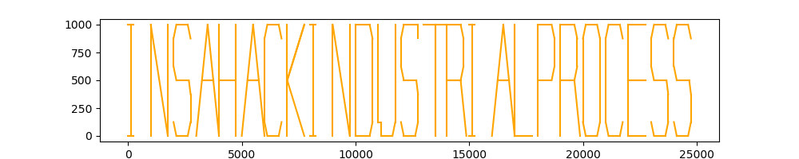

# Industrial-process

__Description__

In company XXX, we have a big expertise in laser cutting and we are well informed about cybersecurity. We have setup a small honeypot to simulate the cut of some pieces. In our fake process, we have manufactured 25 pieces of 1 meter by 1 meter. We have found this really weird file thanks to a super effective detection tool. There was also a weird string :

893c539a84e6c96acf5f2ceea2ad9ef7be895580

This flag follow the following format : INSA([A-Z]*). Please submit it as INSA{$1}, for example if you find INSAAZERTY, submit INSA{AZERTY}. [Weird File](tempList.txt)

__Solutuion__

首先，我們把那串奇怪的東西餵狗，找到[Cloakify](https://github.com/TryCatchHCF/Cloakify/)，代表我們應該要用這個工具Decloakify[檔案](tempList.txt)

之後得到一串tuple，可以發現最後的數字是遞增的，題目有講到這是`laser cutter`，所以最後的數字可能代表不同字，用[python](plot.py)將它畫出來得到：



得到flag

```
INSA{HACKINDUSTRIALPROCESS}
```
