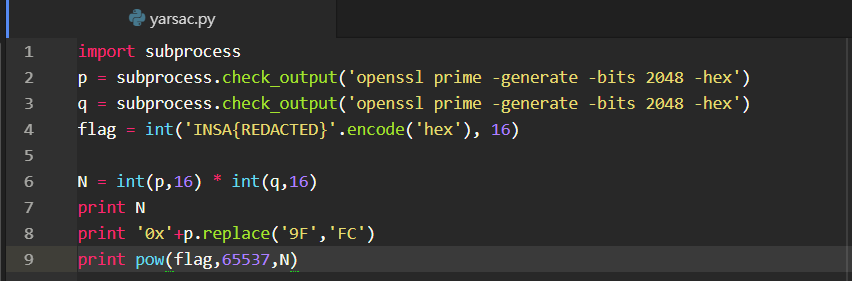

# Yet Another RSA Challenge

__Description__

Buy an encrypted flag, get a (almost intact) prime factor for free !

You can find a harder version of this challenge in the Programming category.

__Solution__

我們拿到原始碼



和[輸出](output.txt/)，p和q是一個2048bits的質數。輸出第一行是N=pxq，第二行是p的hex但是其中的'9F'都被改成'FC'了。第三行則是加密後的密文m。

因為輸出只有4個'FC'，我就窮舉出所有p，再看q=N//p和p的乘積是否為N。最後試出：

```
p_new = A[0]+'FC'+A[1]+'9F'+A[2]+'FC'+A[3]+'9F'+A[4]
```

得到

```
p=27869881035956015184979178092922248885674897320108269064145135676677416930908750101386898785101159450077433625380803555071301130739332256486285289470097290409044426739584302074834857801721989648648799253740641480496433764509396039330395579654527851232078667173592401475356727873045602595552393666889257027478385213547302885118341490346766830846876201911076530008127691612594913799272782226366932754058372641521481522494577124999360890113778202218378165756595787931498460866236502220175258385407478826827807650036729385244897815805427164434537088709092238894902485613707990645011133078730017425033369999448757627854563
q=25819261471728040800872878541553321043152462679774978922658476743054196609615260085066604058841210698540997524876908144621893909307784554414162036327648281377886327091581347296131947730522807494517124526464816238370951647893862934621121004498569156746311594099412832189045390297120305667254913052800653355550915386064296154605648963278915319806240264672354108048953297992497878897540380622959711963257886237782410901325113329109297590870937017452019018930748754331672736756917137583464384303108259463535106592418534804375728748609362332554496296532372320633175091519075027001631454173292550340940515568940345329163887
```

再來就只要求d=65537對(p-1)x(q-1)的模反元素e，即可求出明碼：

```
>>>pow(m,e,N)
505939127013520401783003587681407753905754948958221559896863467356631933
>>>hex(505939127013520401783003587681407753905754948958221559896863467356631933)
b'0x494e53417b495f77316c6c5f7573335f4f54705f6e3378545f54314d337d'
>>>codecs.decode('494e53417b495f77316c6c5f7573335f4f54705f6e3378545f54314d337d','hex')
b'INSA{I_w1ll_us3_OTp_n3xT_T1M3}'
```
