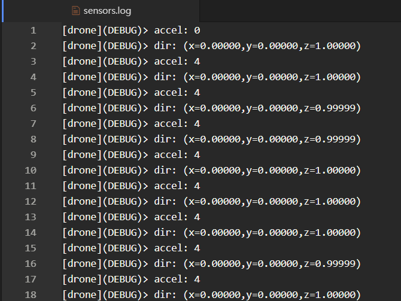
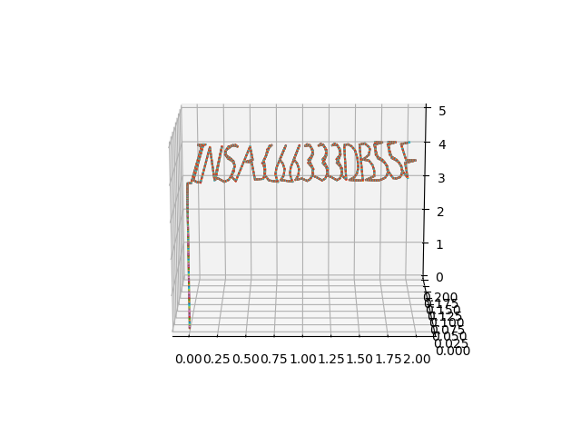
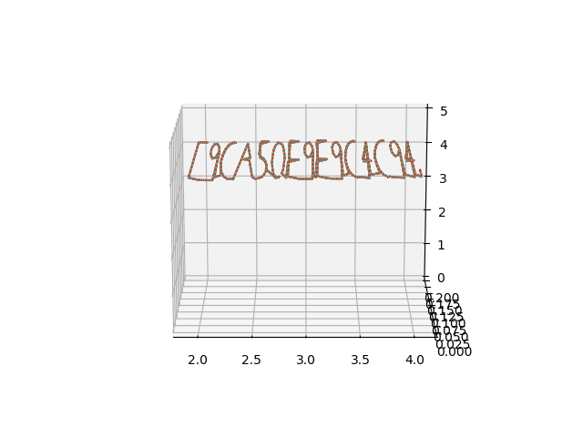
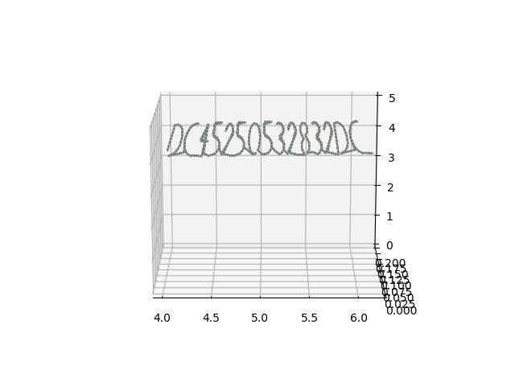
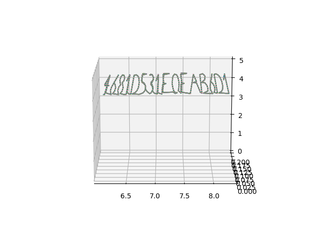
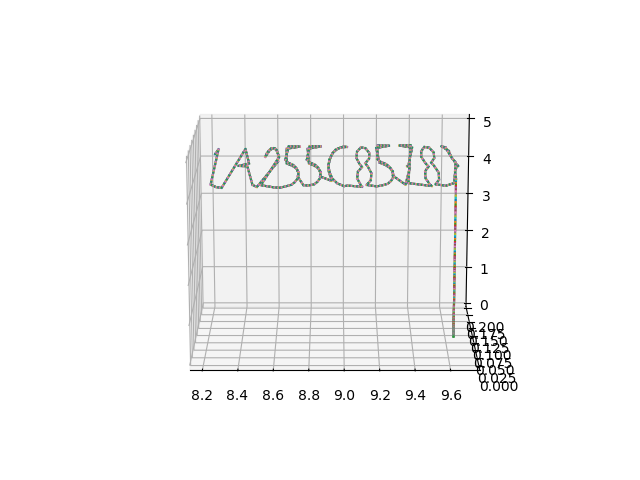

# Drone Motion

__DESCRIPTION__

We intercepted a drone flying above a restricted area and retrieved a [log](https://static.ctf.insecurity-insa.fr/5e97cfb3f4c64201c201a1703440c397f91be74b.tar.gz) from its memory card.

Help us find out what this drone was doing above our heads!

Flag must match the regex: INSA\{[a-f0-9]+\}

__SOLUTION__

我們拿到[sensor.log](sensor.log/)

看起來像是無人機的log，本來我以為x,y,z就是座標，但是畫起來都不太對，後來才想到accel應該是加速度的意思。

之後就是用[pyplot](line.py/)把無人機所在位置畫出來。因為全部印在一起會擠成一團，所以分五張圖畫：

'''
INSA{66333db55e9ca50e9e9c4c94dc45250532832dc4681d531f0fab6d1a255c8578}
'''
