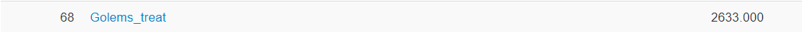

# X-masCTF 2019

X-masCTF is a 7-day long CTF with problems in many different fields.

# Index

| Names                  |Genre               |Point      |
|------------------------|---------------------|----------|
| [`Ancient Christmas`](Ancient%20Cristmas/)|PPC|445|
| [`DeFUNct Ransomware`](DeFUNct%20Ransomware/)|Crypto|25|
| [`FUNction Plotter`](FUNction%20Plotter/)|Misc|50|
| [`Orakel`](Orakel/)|PPC|152|
| [`Pythangoreic Pancakes`](Pythangoreic%20Pancakes/)|PPC|413|
| [`Reverthable X-Math`](Reverthable%20X-Math/)|Rev|85|
| [`Robin's Wish`](Robin's%20Wish/)|Crypto|119|
| [`Rudolph Cipher v5.0`](Rudolph%20Cipher%20v5.0/)|Crypto|485|
