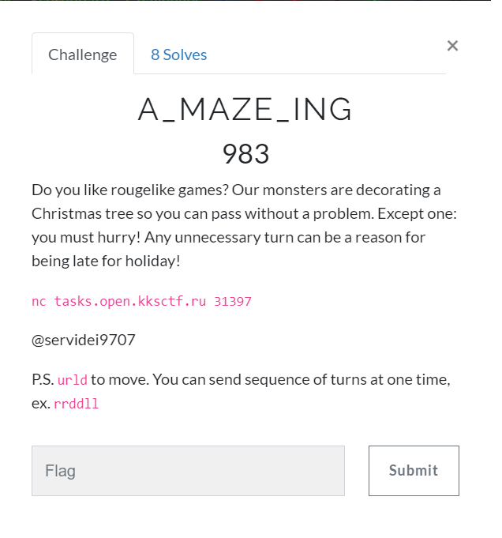
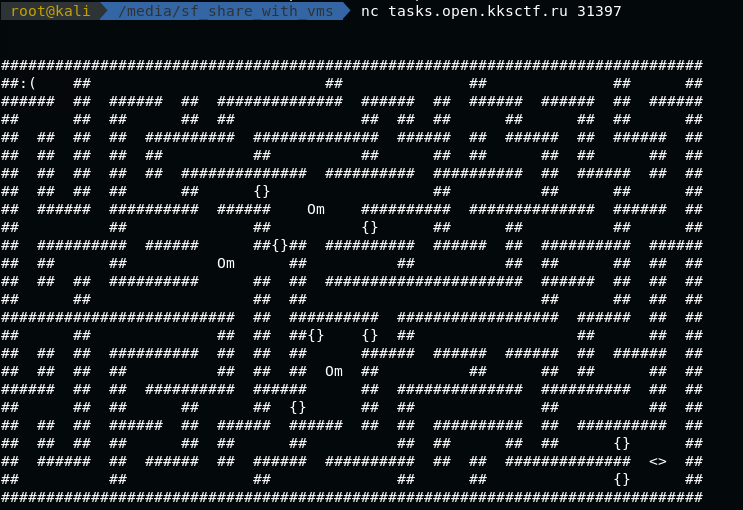
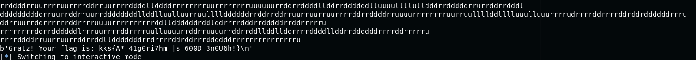

# A_MAZE_ING (PPC) \[983\]

## __Description__



## __Solution__

We have many maze challenges like this:



**Om** means keys, you need this to pass through doors **{}**, and the final goal is **<>**.

You can't make too many steps or it will fail.

Here's my algorithm.

1. Store all reachable points by BFS.

2. Check the goal if it's reachable. If it is, find the shortest path to it and break.

3. Greedy find the closest key by BFS.

4. Greedy find the closest door that the other side is unreachable.

5. Clear all visited point and go to 1.

Chance is low that it failed the test. Here is the [script]('a_maze_ing.py').

After some tiral, I got the flag.



```
kks{A*_41g0ri7hm_|s_600D_3n0U6h!}
```
