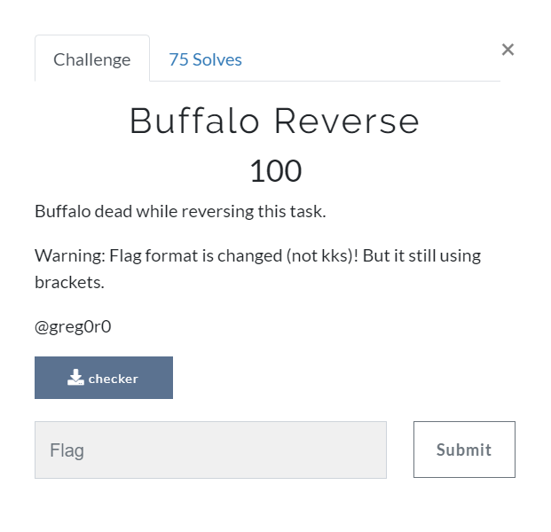

# Buffalo Reverse (Rev) \[100\]

## __Description__



## __Solution__

Guess the first five words are 'flag{' and brute force the rest.

```
...
flag{y0p_brute_he}
flag{y0w_brute_oe}
flag{y0v_brute_ne}
flag{y0u_brute_me}
flag{y0t_brute_le}
flag{y0{_brute_ce}
flag{y0z_brute_be}
...
```
```
flag{y0u_brute_me}
```
