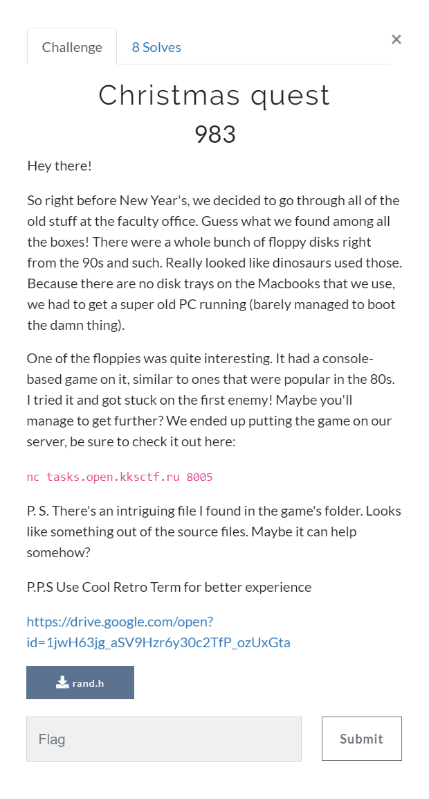
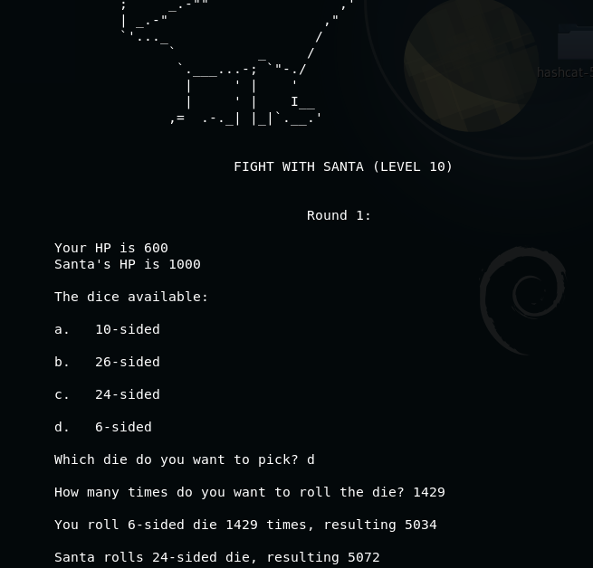

# Christmas quest (Misc) \[983\]

## __Description__



## __Solution__

In the game, you roll a random dice several times and try to reach the target as close as possible.

The target is determined by:

```
#define LIMIT 1000 
...
uint32_t a_very_random_number(){			// Fair and unpredictable!
	float sum = 0 ;
       	if (read(fd, rand_vals, sizeof(uint8_t) * LIMIT) & 0x80000000)
		return 0 ;
	for (uint32_t i = 0 ; i < LIMIT ; i++, sum += (float)rand_vals[i] / (uint8_t)(~0)) ;
	return (uint32_t)sum ;  
}
```

where fd is /dev/urandom, so the number is about 500*LEVEL because it's pretty random.

So the strategy is to choose smallest dice and flip it with 500\*LEVEL/(sides\*0.5+0.5).

For example, in LEVEL 10, you pick 4-sided dice, you should flip it 500\*10/2.5 = 2000 times.



After final battle, you are asked to choose to press GREEN or PURPLE button, press PURPLE and get the flag.

```
kks{M3rry_Chr157m45_4nd_4_H4ppy_N3w_Y34r!_W17h_l0v3,_KKS_TEAM}
```
