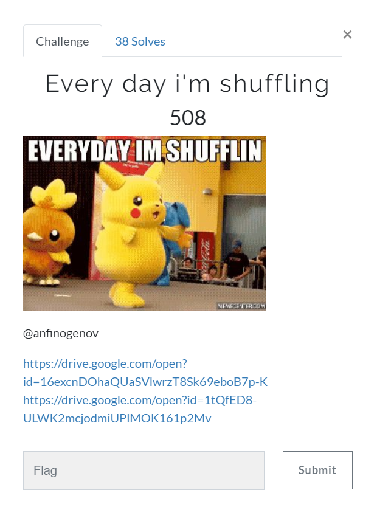

# 
Every day i'm shuffling (Crypto) \[481\]

## __Description__



## __Solution__

```
def main():
    file_name = 'message_from_above'
    data = open(file_name + '.txt', 'r').read()
    seed(randint(1, len(file_name)))
    file_name = list(file_name)
    shuffle(file_name)
```

We know that \'message_from_above\' became \'fsegovs_meaoerbma\', so I try seeding 1~18 and shuffling filename to see whether it matches.

The seed is 3, now we shuffle the list and reverse it.

```
pp = list(range(len(data)))
shuffle(pp)
p = [0]*len(pp)
for i in range(len(pp)):
    p[pp[i]] = i
```

Then use this mapping to reverse the whole process.

The flag can be found in [message_from_above]('message_from_above.txt)

```
kks{5huffl3_5huffl3_5huffl3}
```
