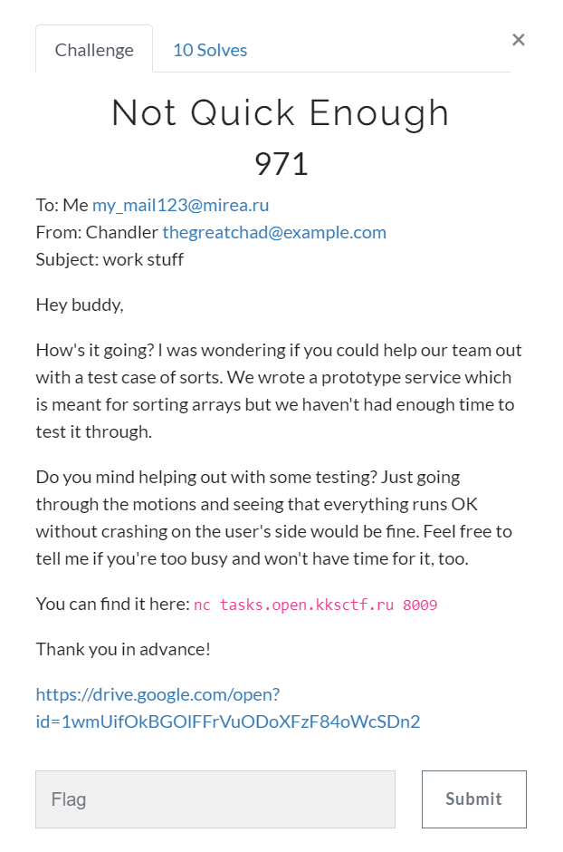
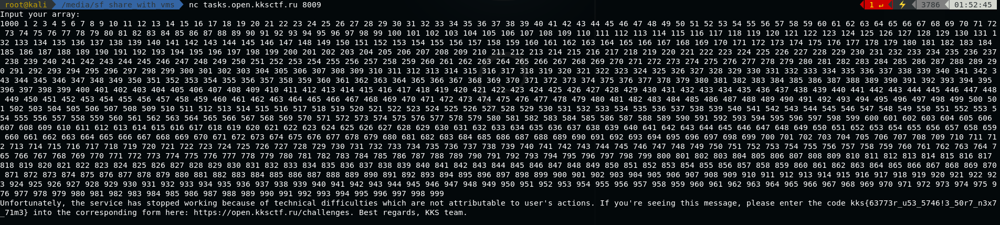

# A_MAZE_ING (Misc) \[971\]

## __Description__



## __Solution__

This task asks us to provide an 1000 elements array that exceeds recursion limit (1000) during quicksort.

The pivot it chooses is the median of left bound, right bound and a random element.

If we can let pivot always be one bound element, and that element is second big element in the array (this means that the other bound is the biggest element), we should be able to reach recursion limit.

```
a1 a2 a3 ...  an            an a2 a3 ...an-1  a1              an a2 a3 ...an-1  a1
^             ^                ^        ^                                 ^     ^
|             |      =>        |        |             =>                  |     |
l             r                l        r                                 r     l
```
An easy way to construct it is 1000 1 2 3 ... 999, and that's how I accomplished it.



```
kks{63773r_u53_5746!3_50r7_n3x7_71m3}
```
