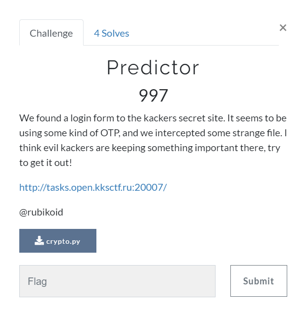
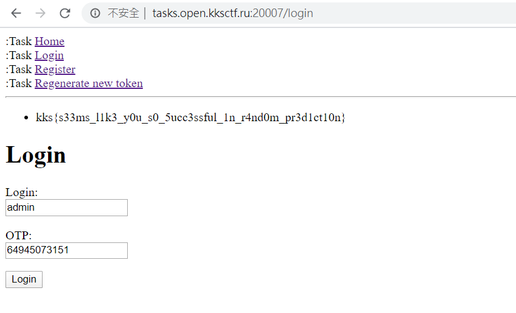

# Predictor (Web) \[997\]

## __Description__



## __Solution__

The server uses random.randint to generate a new seed if you POST a request to /regen.

```
def regen_seed(self):
    self.seed = self.bseed + self.context.basic_random.randint(0, 4294967294)
    self.random = random.Random(self.seed)
```

And the OTP is generated by that seed.

```
def gen_pass(self):
    return self.random.randint(0, 4294967294) * 1337
```

So we can send requset 624 times to predict next seed by [randcrack](https://github.com/tna0y/Python-random-module-cracker), just like what I did in [script](predictor.py).

And then we regenerate the seed for admin, now we can predict the next otp of admin to get the flag!

```
>>> bseed = zlib.crc32("admin".encode())
>>> rc.predict_randrange(0, 4294967294)+bseed
3141917369
>>> random.seed(3141917369)
>>> random.randint(0, 4294967294) * 1337
3094680037435                                     \\first OTP
>>> random.randint(0, 4294967294) * 1337
64945073151                                       \\second OTP
```


```
kks{s33ms_l1k3_y0u_s0_5ucc3ssful_1n_r4nd0m_pr3d1ct10n}
```
