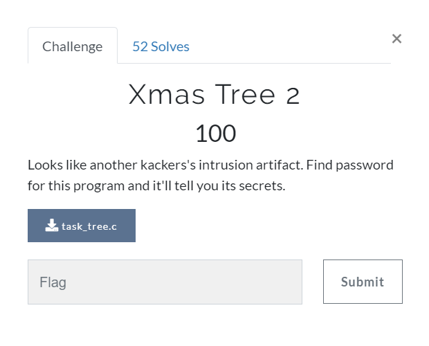

# Xmas Tree 2 (Rev) \[100\]

## Description



## Solution

Reverse the define charcters in [source](task_tree.c) and do some correction you should get [tree.c](tree.c).

The integer \_2 should be 0x317419af to pass the ifs.

I simply put i = 3 and see what came out.

```
>>> kks{c_is_simppi_�nly_when_you_are_drunk}
```

Revise the letters affected by i and you should get the flag.

```
kks{c_is_simple_only_when_you_are_drunk}
```
