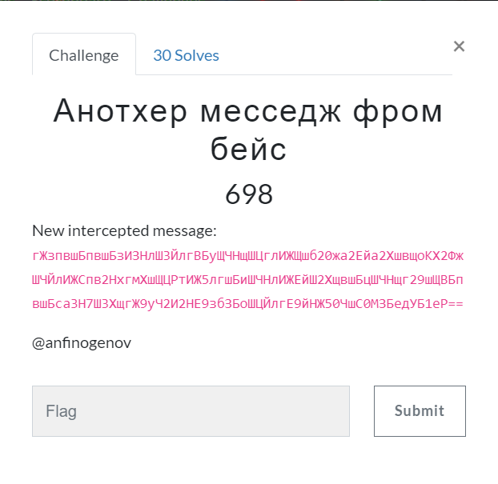

# Анотхер месседж фром бейс (Crypto) \[698\]

## __Description__



## __Solution__

```
>>> ord('А')-ord('A')
975
```
Minus all russians by 975 and get the string.
```
'dGhpcyBpcyBhIHNlY3JldCBtZXNzYWdlIGZyb20ga2Fja2VyczoKV2UgYXJlIGRpc2NvdmVyZWQsIG5ldyBiYXNlIGFjY2VzcyBwYXNzd29yZCBpcyBra3N7Y3VzdG9tX2I2NF9hbHBoYWJldF9jNG50XyR0MHBfeTB1fQ=='
```
Base64 decode it to get the flag.
```
this is a secret message from kackers:\nWe are discovered, new base access password is kks{custom_b64_alphabet_c4nt_$t0p_y0u}
```
```
kks{custom_b64_alphabet_c4nt_$t0p_y0u}
```
